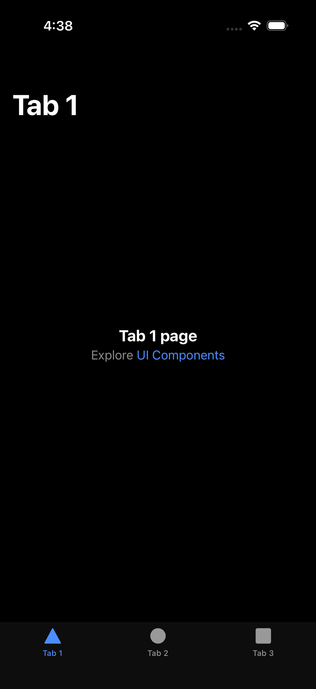
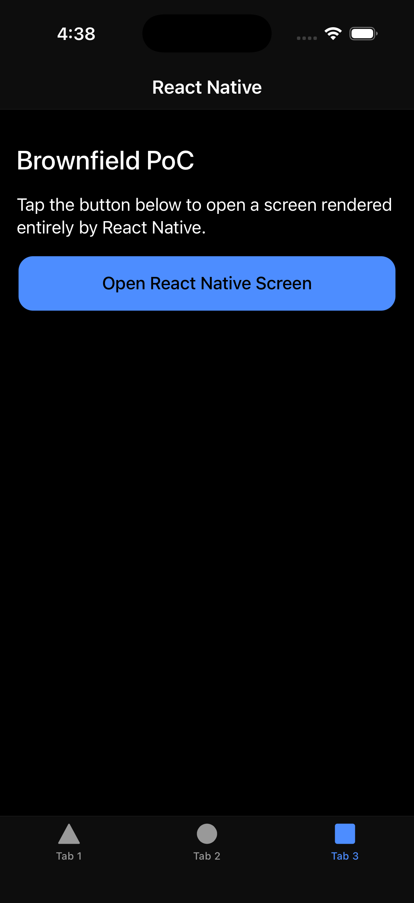
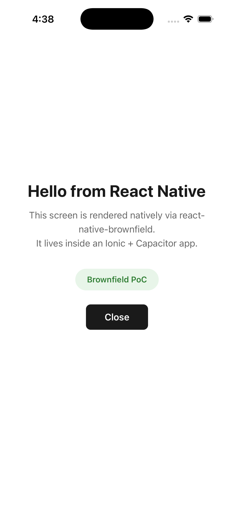

# IonicBrownfieldPoC

Proof of Concept demonstrating React Native screens rendered inside Ionic iOS apps using the Brownfield methodology with [react-native-brownfield](https://github.com/callstack/react-native-brownfield) by Callstack.

Two variants are included: one using Capacitor and one using Cordova as the native runtime.

## Structure

```
IonicBrownfieldPoC/
  rn-module/             # React Native (Expo) project, packaged as XCFramework
  ionic-app/             # Ionic + Angular + Capacitor variant
  ionic-app-cordova/     # Ionic + Angular + Cordova variant
```

Both variants consume the same XCFramework artifact produced by the `rn-module`.

## Tech Stack

| Component | Technology |
|-----------|-----------|
| RN Module | Expo SDK 54, react-native-brownfield v3.3 |
| Capacitor Variant | Ionic 7+, Angular, Capacitor 6+ |
| Cordova Variant | Ionic 7+, Angular, cordova-ios 8.0.1 |
| JS Engine | Hermes |
| Platform | iOS |

## Prerequisites

- macOS with Xcode 26+ (Tahoe)
- Node.js 22+
- CocoaPods 1.15+
- Ionic CLI: `npm install -g @ionic/cli`
- Cordova CLI (for Cordova variant): `npm install -g cordova`

## Setup

### 1. Clone and install

```bash
git clone git@github.com:Doberjohn/IonicBrownfieldPoC.git
cd IonicBrownfieldPoC
```

### 2. Build the RN Module (only needed if modifying the RN screen)

The XCFrameworks are already committed to the repo. This step is only necessary if you want to change the React Native screen and repackage.

```bash
cd rn-module
npm install
npm run brownfield:package:ios
cd ..
```

This produces three `.xcframework` files in `rn-module/ios/.brownfield/package/build/`.

### 3a. Run the Capacitor variant

```bash
cd ionic-app
npm install
ionic build
npx cap sync
```

If the XCFrameworks need to be re-copied (e.g. after repackaging):

```bash
mkdir -p ios/App/Frameworks
cp -r ../rn-module/ios/.brownfield/package/build/*.xcframework ios/App/Frameworks/
```

Open in Xcode:

```bash
npx cap open ios
```

In Xcode, verify the three `.xcframework` files are in **General > Frameworks, Libraries, and Embedded Content** with **Embed & Sign**. If not, add them manually.

Build and run on the iOS Simulator. Navigate to Tab 3 and tap "Open React Native Screen".

### 3b. Run the Cordova variant

```bash
cd ionic-app-cordova
npm install
ionic build
cordova prepare ios
```

If the XCFrameworks need to be re-copied (e.g. after repackaging):

```bash
mkdir -p platforms/ios/Frameworks
cp -r ../rn-module/ios/.brownfield/package/build/*.xcframework platforms/ios/Frameworks/
```

Open in Xcode:

```bash
open platforms/ios/App.xcworkspace
```

In Xcode, verify the three `.xcframework` files are in **General > Frameworks, Libraries, and Embedded Content** with **Embed & Sign**. If not, add them manually.

Build and run on the iOS Simulator. Navigate to Tab 3 and tap "Open React Native Screen".

## How It Works

### Screenshots

| Ionic App (Tab 1) | Brownfield Tab (Tab 3) | React Native Screen |
|:--:|:--:|:--:|
|  |  |  |

### Architecture

```
Angular (WebView)
    |
    v
Bridge Plugin (Capacitor or Cordova)
    |
    v
react-native-brownfield API (from XCFramework)
    |
    v
React Native Screen (Hermes + JS Bundle)
```

### Capacitor variant

- `ReactNativeBridgePlugin.swift` - Capacitor plugin that presents the RN screen
- `MyViewController.swift` - Registers the plugin with Capacitor 6+ bridge
- `AppDelegate.swift` - Initializes the RN runtime at app launch
- `src/app/plugins/react-native-bridge.ts` - TypeScript plugin definition using `registerPlugin()`

### Cordova variant

- `ReactNativeBridgePlugin.h/.m` - Objective-C Cordova plugin (CDVPlugin subclass)
- `ReactNativeBridgeHelper.swift` - Swift helper that calls brownfield APIs (needed because BrownfieldLib exposes Swift-only APIs not available from Objective-C)
- RN initialization happens in the plugin's `pluginInitialize` (no AppDelegate modification needed)
- `src/app/plugins/react-native-bridge.ts` - TypeScript bridge using `cordova.exec()`
- Plugin registered via `<feature>` in `platforms/ios/App/config.xml`

### Dismiss flow

The RN screen uses `ReactNativeBrownfield.postMessage("dismiss")` to signal the native side. The plugin listens via `ReactNativeBrownfield.shared.onMessage` and dismisses the presented view controller.

## Troubleshooting

| Issue | Solution |
|-------|----------|
| Yarn PnP errors | Remove `~/.pnp.cjs` if present. Use `--package-manager=npm` |
| UNIMPLEMENTED (Capacitor) | Register plugin via custom ViewController, not .m macros |
| Plugin not found (Cordova) | Ensure `<feature>` is in `platforms/ios/App/config.xml` with correct class name (no module prefix) |
| cordova not found on window | Add `<script src="cordova.js"></script>` to `src/index.html` |
| Cannot find native module ExpoAsset | Add `ensureExpoModulesProvider()` + app launch forwarding |
| Black screen | Missing RN initialization in AppDelegate (Capacitor) or pluginInitialize (Cordova) |
| Infinite loading spinner (Cordova) | Remove `cordova-plugin-ionic-webview`. It conflicts with cordova-ios 8 |

## Documentation

Detailed step-by-step guides are available as Word documents:

- `IonicBrownfieldPoC-Guide-v3.docx` - Capacitor variant guide
- `IonicBrownfieldPoC-Cordova-Guide.docx` - Cordova variant guide
